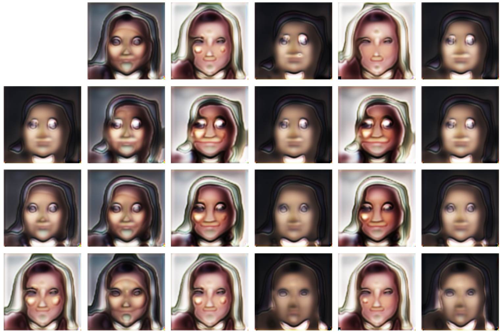
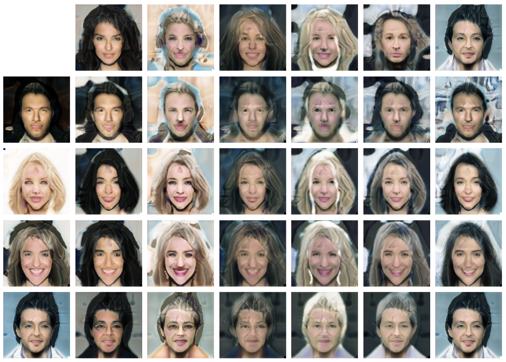

An implementation of StyleGAN on CelebA dataset.

## Install 

```shell script
git clone https://github.com/MorvanZhou/celebA-styleGAN
cd celebA-styleGAN
pip install -r requirements.txt
```

## Process data
Download CelebA 

- [img_align_celeba.zip](https://drive.google.com/file/d/0B7EVK8r0v71pZjFTYXZWM3FlRnM/view?usp=sharing) (~1.4GB) 
- [list_attr_celeba.txt](https://drive.google.com/file/d/0B7EVK8r0v71pblRyaVFSWGxPY0U/view?usp=sharing) (25MB) 

to celebA_img_align folder, then unzip img_align_celeba.zip to the same folder.

process data to tensorflow tensor_record format.

```shell script
python dataset.py --data_dir ~/data/celebA_img_align/
```

## Train

```shell script
python train.py --data_dir ~/data/celebA_img_align/ -b 16 --latent 128 --lambda_ 20 --epoch 101 -lr 0.001 -b1 0. -b2 0.99
python train.py --data_dir D:/data/celebA_img_align/ -b 14 --latent 128 --epoch 101 -lr 0.0002 -b1 0. -b2 0.99 --lambda_ 10
```

## Results

First few of epoch:



After one day:


